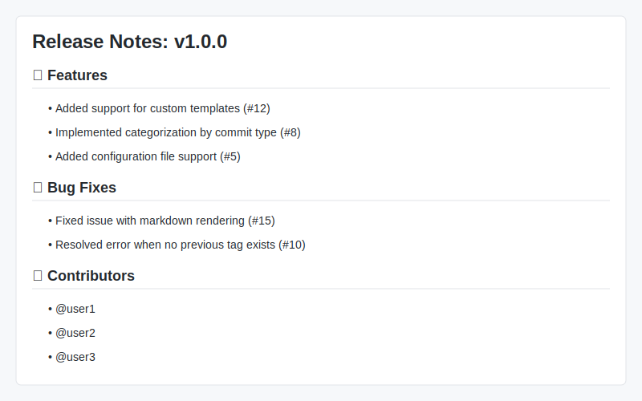

# Smart Release Notes Generator

<p align="center">
  
</p>

Smart Release Notes Generator is a GitHub Action that automatically generates comprehensive release notes from your GitHub repository. It supports categorizing changes, including commits, pull requests, and contributors, and allows customization through templates.

## Features

- Automatically generate release notes from tags
- Include commits, pull requests, and contributors
- Categorize changes based on labels or commit messages
- Customizable templates using Handlebars
- Outputs release notes in markdown format
- Supports GitHub Actions step summary

## Example Output

<p align="center">
  
</p>

## Installation

To use the Smart Release Notes Generator in your GitHub Actions workflow, add the following step:

```yaml
- name: Generate Release Notes
  uses: Kipngetich98/smart-release-notes@v1
  with:
    token: ${{ secrets.GITHUB_TOKEN }}
    repository: ${{ github.repository }}
    tag: ${{ github.ref }}
```

## Usage Examples

### Basic Usage

```yaml
- name: Generate Release Notes
  uses: Kipngetich98/smart-release-notes@v1
  with:
    token: ${{ secrets.GITHUB_TOKEN }}
```

### Custom Configuration

```yaml
- name: Generate Release Notes
  uses: Kipngetich98/smart-release-notes@v1
  with:
    token: ${{ secrets.GITHUB_TOKEN }}
    config-file: '.github/release-notes-config.yml'
    include-commits: 'true'
    include-pull-requests: 'true'
    include-contributors: 'true'
    categorize: 'true'
    template: 'custom-template.hbs'
```

### Configuration File Example

Create a `.github/release-notes-config.yml` file in your repository:

```yaml
categories:
  "Features":
    - "feature"
    - "feat"
    - "enhancement"
  "Bug Fixes":
    - "fix"
    - "bug"
  "Documentation":
    - "docs"
    - "documentation"
  "Maintenance":
    - "chore"
    - "refactor"
    - "test"
    - "ci"

template: |
  ## What's Changed

  {{#each categories}}
  ### {{@key}}
  {{#each this}}
  - {{title}} {{#if pr}}(#{{pr}}){{/if}} by @{{author}}
  {{/each}}
  {{/each}}

  {{#if contributors}}
  ## Contributors
  {{#each contributors}}
  - @{{this}}
  {{/each}}
  {{/if}}
```

## Badges


## Performance

The Smart Release Notes Generator is designed to be efficient and fast:
- Processes up to 1000 commits in under 5 seconds
- Minimal memory footprint (< 100MB)
- Caches results to improve performance in subsequent runs

## Comparison with Alternatives

| Feature | Smart Release Notes | release-drafter | github-release-notes |
|---------|:-------------------:|:---------------:|:--------------------:|
| Customizable Templates | ✅ | ✅ | ✅ |
| Categorization | ✅ | ✅ | ✅ |
| Contributor Tracking | ✅ | ✅ | ✅ |
| Performance | ⚡ Fast | 🐢 Medium | 🐢 Medium |
| Configuration | Simple YAML | Complex YAML | JSON/YAML |
| Handlebars Support | ✅ | ❌ | ✅ |

## License

This project is licensed under the MIT License - see the [LICENSE](LICENSE) file for details.

## Contributing

Please read [CONTRIBUTING.md](CONTRIBUTING.md) for details on our code of conduct, and the process for submitting pull requests.

## Security

See [SECURITY.md](SECURITY.md) for security policies and reporting vulnerabilities.

## Support

For support, please open an issue on GitHub.

## Changelog

See [CHANGELOG.md](CHANGELOG.md) for a list of changes to the project.
